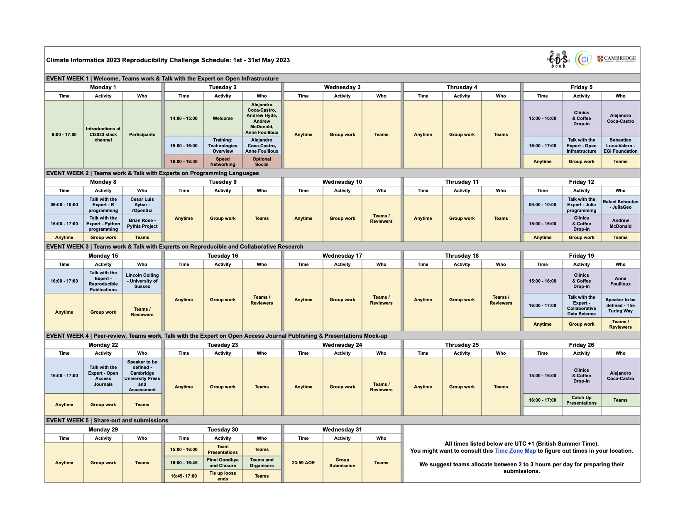

(details-timeline-schedule)=

# Timeline and Schedule

## Key dates
* Challenge Registration Closes (Participants): 28 April @ 23:59 AOE
* Challenge Registration Closes (Reviewers): 13 May @ 23:59 AOE
* Teams & Project Assignments Announced: 30 April
* Challenge Begins: 1 May @ 00:00 AOE
* Peer Review Begins: 15 May @ 00:00 AOE
* Challenge Ends: 31 May @ 23:59 AOE
* Results Announced: 15 June
* Submissions Integrated into EDS Book: Throughout summer

## Schedule

:::{note}
Although the schedule is almost set, we will still make some adjustments to it, so please check back!
:::

All CI2023 Reproducibility Challenge activities will take place virtually on May 1-31. 
The Zoom link is pinned on the #6-reproducibility-challenge channel in the CI2023 slack workspace. 
We will have an overview of technologies, followed by a series of talk with the expert sessions. 
We strongly encourage participants to attend these sessions.
Clinics & Coffee Drop-in OPTIONAL activities will be on Fridays 15:00-16:00. 
See the schedule below for details.

All times listed below are UTC + 1 (British Summer Time). You might want to consult this [Time Zone Map](https://www.timeanddate.com/time/map/) to figure out times in your location.

We suggest teams allocate an average of about 2 hours per day for preparing their submissions.

The schedule is also available as a Google Calendar (see [here](https://calendar.google.com/calendar/embed?src=6d3b3d272eecb65d0ba680044dc78a099be74ba53660d6ec1f93285978d97a46%40group.calendar.google.com&ctz=Europe%2FLondon)).

