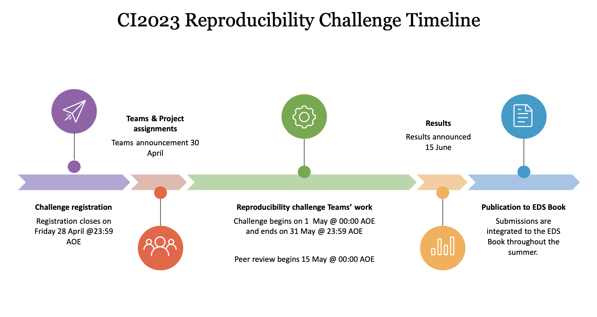

# Team logistics

In this section, you will find all the information you need to easily work in your team.

## Timeline Infographic

## Communication

We try to limit the number of communication channels to make sure there is no misunderstanding on what tools to use for communication.

Each team is of course free to organize itself differently and can set up different internal communication channels.

### Slack

All participants, mentors, experts, judges will be invited to the **[Climate Informatics 2023](ci23.slack.com)** Slack and we will be using **# 6-reproducibility-challenge** channel for all our internal communications. Contact Andrew McDonald at arm99@cam.ac.uk if you have not been invited yet.

The organizers will post regular information in **# 6-reproducibility-challenge** channel, for instance:
- Ice-breaker activities;
- Info (date, time, zoom link) about clinics to meet and chat with experts;
- Info about checkpoints (date, time, zoom link) where each team will be invited to unformaly present the status and progress of their reproducibility work.

We strongly encourage collaborations within your team but also inter-teams. Participants can ask for help in **# 6-reproducibility-challenge** channel and everyone is invited to participate to the discussions and answer. 

To make sure the **# 6-reproducibility-challenge** channel does not become too messy, we strongly encourage the [usage of threads to organize discussions](https://slack.com/help/articles/115000769927-Use-threads-to-organize-discussions-).

### Zoom

We will be using zoom for the clinics and checkpoints. The zoom link will be communicated in the **# 6-reproducibility-challenge**  slack channel. **Please do not share the zoom link online to make sure we keep a safe environment for all participants.** 

:::{tip}

All communications during the CI2023 reproducibility challenge are regulated by the [Environmental Data Science Book Code of Conduct](https://raw.githubusercontent.com/alan-turing-institute/environmental-ds-book/master/CODE_OF_CONDUCT.md).
:::

